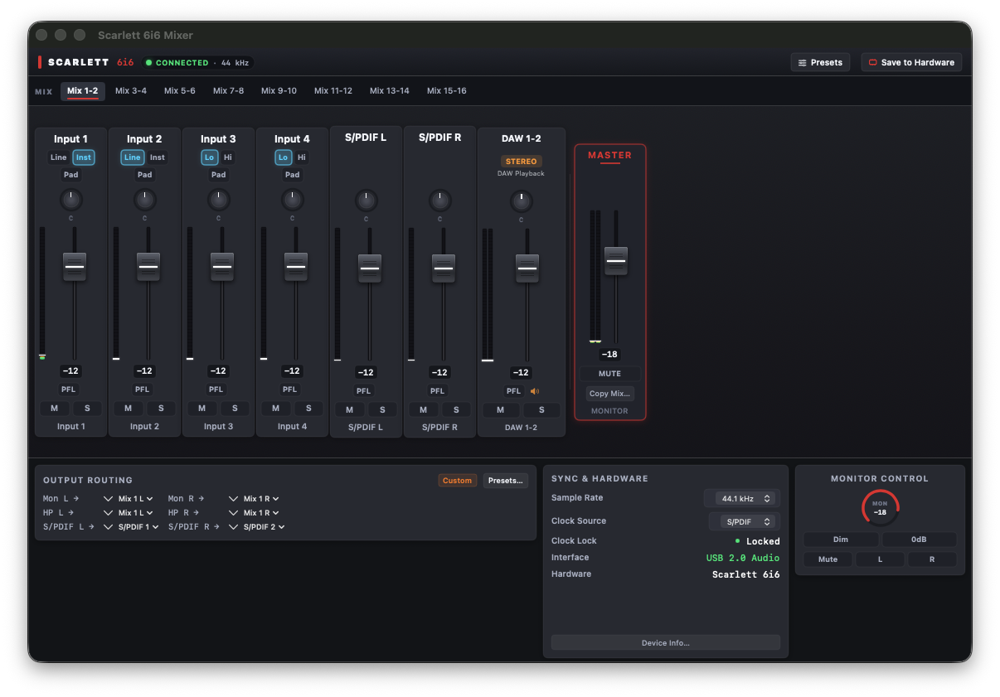

# Scarlett 6i6 Mixer for macOS

A native macOS control panel for the **Focusrite Scarlett 6i6 (1st Gen)**, written in SwiftUI, with a small C daemon that talks to the hardware over USB.

## The problem

Focusrite's **Mix Control** (the only control app for 1st-gen Scarletts) was **dropped on macOS** — it stopped being maintained and doesn't work reliably on modern macOS versions. Focusrite's replacement (the web-based Focusrite Control 2) only supports 2nd Gen and later devices, so 1st-gen owners are left with a hardware mixer with no software to control it.

This project reverse-engineers the 6i6 1st-gen USB control protocol on macOS and gives you back full offline control of your interface.



## Download

Grab the latest release from the [Releases page](https://github.com/Vumet3r/scarlett-6i6-mixer/releases) — `Scarlett-6i6-Mixer-v0.2.0-beta.zip`. No installers, no kernel drivers, no daemon setup: the app bundles everything it needs.

1. Download and unzip
2. **Right-click the app → Open** (required on first launch: the app is not Apple-notarized, so Gatekeeper will ask for confirmation) and click Open again
3. Optionally drag it to your Applications folder

Requirements: **macOS 14+** and a connected **Scarlett 6i6 (1st Gen)**.

## Features

- **Modern Studio UI** — dark graphite console aesthetics, realistic faders with grip ridges, calibrated 3-stage LED meters, and rotary pan knobs with radial arcs
- **Stereo DAW playback** — unified DAW 1-2 channel with dual L/R peak meters, fader, and balance control
- **Quick routing presets** — one-click setups for DAW / GarageBand (software monitoring), Direct Guitar (zero-latency DSP mix), Mix 1, and 1-to-1 default
- **Matrix mixer / routing** — every input (analog, S/PDIF, ADAT) to every output, with accurate dB scaling
- **Level meters** — 10 Hz polling with fast decay and click-to-reset peak hold
- **Preamps** — gain (Lo/Hi, Line/Inst), 10kΩ pad, phantom power switching
- **Clock & sample rate** — clock source (`Internal` / `S/PDIF` / `ADAT`) and 44.1–96 kHz rate selection, straight from the UI
- **Presets** — JSON save/load/export/import, plus **write presets to the hardware's internal flash** (like Mix Control)
- **Zero setup** — ships as a `.app` bundle with the daemon embedded; no kernel drivers, no kexts, no Mix Control needed
- **Resilience & Safety** — feedback loop protection, daemon auto-respawns, watchdog recovers from USB resets, app auto-reconnects
- **No notifications required** — the 1st-gen interrupt endpoint is not exposed on macOS, so the daemon polls the hardware instead

## Architecture

```
┌─────────────────────────┐         ┌──────────────────────────────────┐
│  fase-2-gui/ (SwiftUI)  │  UNIX   │  fase-1-daemon/ (C, IOUSBHost)  │
│  Scarlett 6i6 Mixer.app │ socket  │  scarlett-6i6d                  │
│                         │◄───────►│  /tmp/scarlett-6i6.sock         │
└─────────────────────────┘         └───────────────┬──────────────────┘
                                                    │ USB vendor protocol
                                                    ▼
                                          Focusrite Scarlett 6i6 (1st Gen)
```

- `fase-1-daemon/` — C daemon (`src/main.c`, `src/usb-io.mm`): opens the device, decodes the 1st-gen register protocol (direct URBs with `wValue`/`wIndex`), serves a simple line-based socket API (`DUMP`, `SET mix`, `SET preamp`, `SET clock`, `SET rate`, `SET save`, …)
- `fase-2-gui/scarlett-app/` — Swift package with the SwiftUI app: matrix view, preamps, meters, clock/rate pickers, presets panel
- `fase-2-gui/package.sh` — assembles `dist/Scarlett 6i6 Mixer.app` with the daemon embedded in `Contents/Resources`

The daemon launches automatically from the app (`DaemonManager`), so you just open the app and the interface comes alive.

## Build & run

Requirements: macOS 14+, Xcode Command Line Tools.

```bash
# 1. Build the daemon
cd fase-1-daemon && make

# 2. Build the app (from repo root)
cd fase-2-gui/scarlett-app && swift build

# 3. Package the .app (includes daemon)
cd fase-2-gui && ./package.sh

# 4. Run
open "dist/Scarlett 6i6 Mixer.app"
```

Or run the daemon standalone for headless control:

```bash
fase-1-daemon/scarlett-6i6d &
echo "DUMP" | socat - UNIX-CONNECT:/tmp/scarlett-6i6.sock
```

## Hardware support

- **Supported:** Focusrite Scarlett 6i6 **1st Gen** (verified on real hardware)
- **Not supported:** 2nd Gen and newer (they use the FCP vendor protocol, not the 1st-gen register map), other Scarlett models, Clarett/Vocaster.

## Credits & references

This project is a clean-room-ish macOS port that could not exist without the Linux audio community's work. It uses no code from them (except as reference), but the protocol knowledge was built from:

- **[Linux ALSA Scarlett mixer driver](https://github.com/geoffreybennett/linux-scarlett)** (`sound/usb/mixer_scarlett.c`, GPL-2.0-or-later) — the 1st-gen register map (mix matrix, preamps, gain/DB scaling) used by the daemon
- **[fcp](https://github.com/geoffreybennett/fcp) — Geoffrey D. Bennett's Focusrite Control Protocol kernel driver** (GPL-2.0) — the FCP vendor protocol used by 2nd Gen+; documented for a possible future extension (the 6i6 1st Gen uses plain register URBs instead)
- **[alsa-scarlett-gui](https://github.com/Kemuri/alsa-scarlett-gui)** by Kemuri — Linux control panel; UI layout and meter behaviour informed ours
- **[scarlett-mixcontrol-1stgen](https://github.com/Nas3nmann/scarlett-mixcontrol-1stgen)** — Focusrite's community-edition Mix Control for 1st Gen, used as reference for preset format and reconnect behaviour

## License

GPL-2.0 — the daemon derives from GPL-2.0 protocol documentation and register maps from the ALSA ecosystem; the whole repository is released under the same license.
